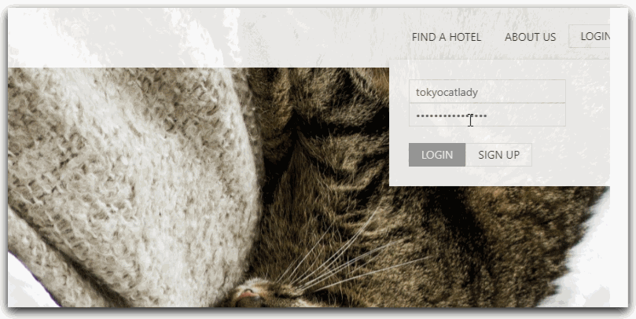
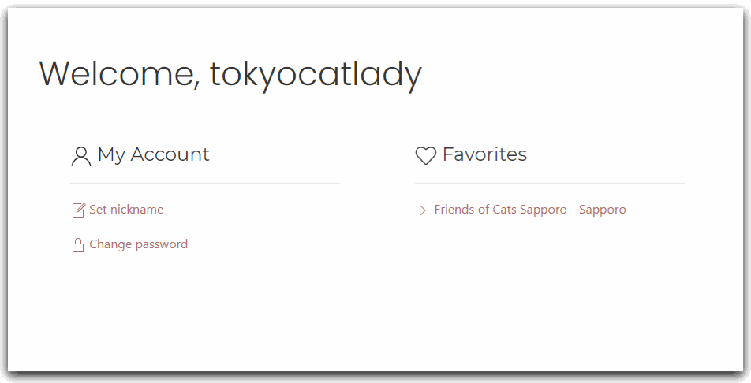
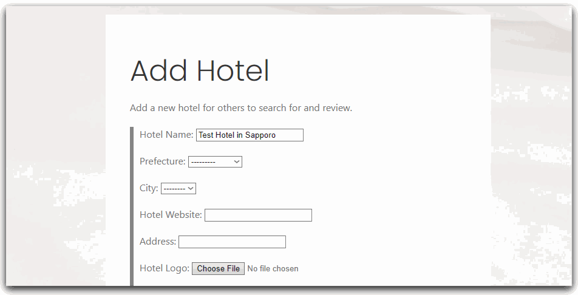
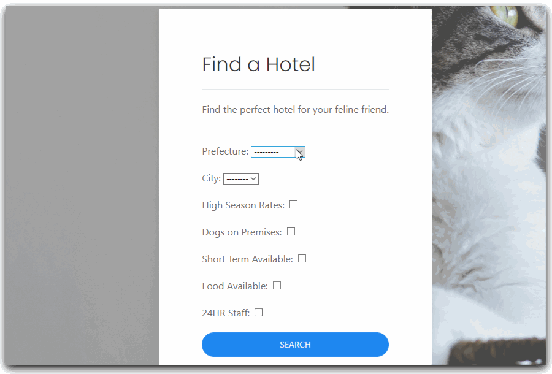
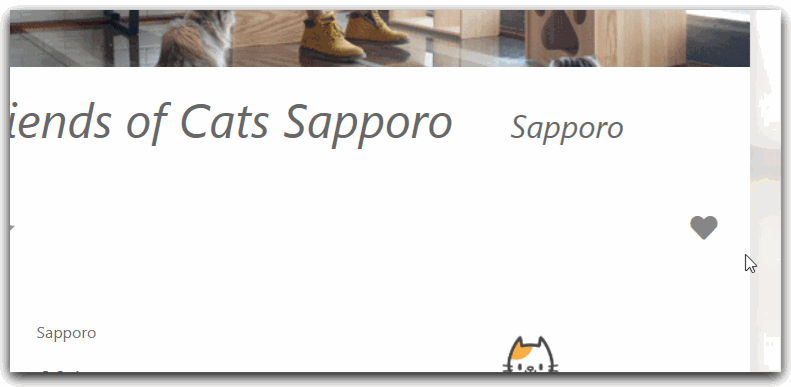
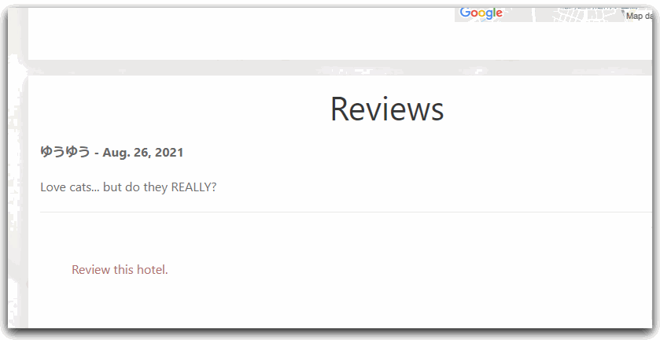
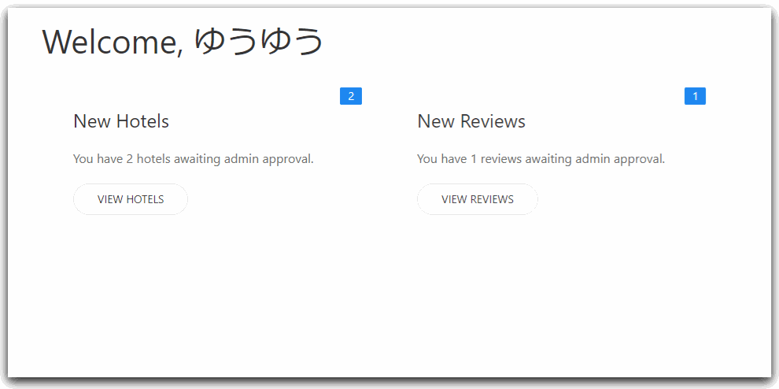

# TabiNyans
Mock website for searching for and reviewing cat-friendly pet hotels in Japan.

## :cat2: Live Preview: Currently Offline :cat2:</a>
Screenshots available below.

| Role | Username | Password |
| ------------- | ------------- | ------------|
| Test User  | testuser | tabi9nyans |
| Test Moderator | testmod | tabi9mod |

<i>Please return changed passwords to default after test.</i>
               <a href="https://forms.gle/wk18DwHua6kcD7tt9">Contact me</a><i> if you experience any problems.</i>

## About TabiNyans
<i>TabiNyans</i> is a mock hotel reservation and review website with a theme
close to my heart: cat hotels. Any cat-lover knows that it's hard to find a good pet hotel that also accepts cats.
<i>TabiNyans</i> is a (fictional) answer to that problem.

<i>TabiNyans</i> was created with [ <b>Python</b> ] in [ <b>Django</b> ]. It was originally created using Django's default [ sqlite ] database,
 which was then migrated to a [ <b>postgreSQL</b> ] database for production. Front-end was created with the help of the [ <b>UIkit</b> ] Framework.

Static files were served by [ <b>AWS S3</b> ], the database managed by [ <b>AWS RDS</b> ], and deployment handled by [ <b>AWS App Runner</b> ].

User registration and authentication is handled by Django's built-in auth system. The navbar changes to allow logged in users to
submit new hotels and access their user page, as well as a moderation queue for users in the moderator group.

---

<i>Navbar showing user-specific links</i>

---

<i>Changing nickname to be displayed on userpage/comments.</i>

---
Logged in users can submit new hotels,
including uploading hotel logos and images. The hotel is then added to the
the moderation queue.

<i>Adding a new hotel.</i>

---
Anyone can search for hotels. Cities are automatically populated upon selecting a prefecture. Registered users
can add hotels to a favorites list.

<i>Searching for hotels.</i>

<i>Liking and disliking hotels adds and removes them from Favorites on your userpage.</i>

---
Registered users can comment on and rate
hotels. Comments enter a moderation queue.

 <i>Commenting on a hotel.</i>

---
Users in the moderator group can
 also see the moderation page, where they can approve or delete new comments
 and hotels.

 
  <i>Moderating new hotels and comments.</i>

  ---
  # :sparkles: Thank you for reading!	:sparkles:
